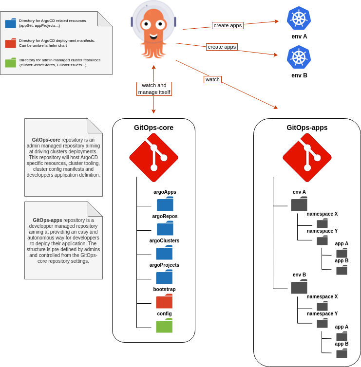
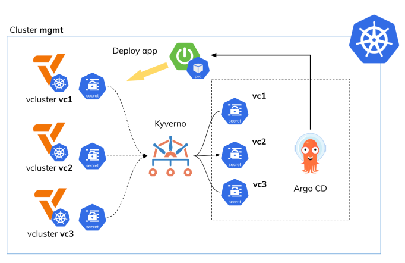

# GitOps-core

> [!CAUTION]
> This structure is opinionated and result from multiple experiences using ArgoCD in Enterprise grade environments

## Structure

This git repository is the main ArgoCD repo. It contains the definition of the ArgoCD deployment itself as well as the definitions of the different ArgoCD objects (`Application`, `ApplicationSet`, `AppProject`...etc).

<p align="center">
  
</p>


The structure of the repository is as follows:

```bash
.
├── argoApps
├── argoClusters
├── argoProjects
├── argoRepositories
├── bootstrap
│   ├── Chart.lock
│   ├── charts
│   │   ├── argo-cd-x.y.z.tgz
│   │   ├── argocd-apps-x.y.z.tgz
│   │   └── argocd-image-updater-x.y.z.tgz
│   ├── Chart.yaml
│   └── values-bootstrap.yaml
├── config
│   ├── prd
│   │   ├── namespace-A
│   │   ├── namespace-B
│   │   └── namespace-C
│   └── stg
│       ├── namespace-A
│       ├── namespace-B
│       └── namespace-C
└── README.md
```

The installation of ArgoCD respects the app of apps pattern recommended by ArgoCD
- https://argo-cd.readthedocs.io/en/stable/operator-manual/cluster-bootstrapping/#app-of-apps-pattern

Each directory is intended for a specific use:

- `argoApps`: contains the definition of all applications (the `Application` and `ApplicationSet` objects)
- `argoClusters`: contains connection information to the different kubernetes clusters to which ArgoCD has access (Use `ExternalSecret` when necessary)
- `argoProjects`: contains the definition of Argocd projects (the `AppProject` objects)
- `argoRepositories`: contains connection information to the different repositories or registries to which ArgoCD can connect (Use `ExternalSecret` when necessary)
- `bootstrap`: contains the ArgoCD instance deployment manifests in `Helm` format here.
- `config`: contains the specific configuration of each cluster

### Bootstrap : first install

You can create custom password if you want:

```bash
htpasswd -nbBC 10 "" $ARGO_PWD | tr -d ':\n' | sed 's/$2y/$2a/'
```

Add it to `values-bootstrap.yaml` :
```yaml
argo-cd:
  configs:
    secret:
      argocdServerAdminPassword: "<hashed-value>"
```

> [!NOTE]
> You can also get default password :
> 
> ```bash
> kubectl get secret -n argocd argocd-initial-admin-secret -ojson | jq -r '.data.password' | base64 -d
>kubectl get secret -n argocd argocd-initial-admin-secret -o jsonpath="{.data.password}" | base64 -d
> ```

The first installation of ArgoCD is the one and only time (except in extreme/special cases of recovery or specific maintenance) where the helm CLI is used to carry out the installation. All subsequent updates are made via git.

```bash
helm upgrade -i argocd bootstrap/ -n argocd --create-namespace -f bootstrap/values-bootstrap.yaml --set apps.enabled=false --set updater.enabled=false
```

Then install applications:
```bash
helm upgrade -i argocd bootstrap/ -n argocd --create-namespace -f bootstrap/values-bootstrap.yaml --set apps.enabled=true --set updater.enabled=true
```

This command build app of apps pattern.


### ArgoCD configuration 

ArgoCD is installed with community Helm chart:
- https://github.com/argoproj/argo-helm.git

To update the ArgoCD configuration, simply modify the values in the `values-bootstrap.yaml` file then push the changes to the git repo and wait for ArgoCD synchronization (or force it to go faster).

### Update Helm chart

The `Chart.yaml` file is also important for updating the version of the ArgoCD Helm chart as well as other charts used.

To update the helm chart, execute the following commands after updating the version in the `Chart.yaml` file:

```bash
helm dep update
```

### Create new app

To create a new application, simply add an `Application` or `ApplicationSet` file in the `argoApps` folder then synchronize the application brick in question in ArgoCD (or wait, it's automatic).


### Auth OCI registry Helm

To authenticate ArgoCD to the registry, you must use a ServiceAccount with appropriate permissions. Create the Google SA and assign permissions:
```bash
gcloud iam service-accounts create argocd
gcloud projects add-iam-policy-binding example --member="serviceAccount:argocd@example.iam.gserviceaccount.com" --role="roles/artifactregistry.reader"
```

Check:
```bash
gcloud projects get-iam-policy example --flatten="bindings[].members" --format='table(bindings.role)' --filter="bindings.members:argocd@example.iam.gserviceaccount.com"
```

Create JSONKEY:
```bash
gcloud iam service-accounts keys create ./argocd.json --iam-account argocd@example.iam.gserviceaccount.com
```
Create secret:
```yaml
---
apiVersion: v1
kind: Secret
metadata:
  name: gar-oci-helm
  namespace: argocd
  labels:
    argocd.argoproj.io/secret-type: repository
  annotations:
    managed-by: argocd.argoproj.io
stringData:
  enableOCI: "true"
  name: gar-oci-helm
  type: helm
  url: europe-west9-docker.pkg.dev/example/charts
  username: _json_key
data:
  password: BASE64_FROM_SERVICE_ACCOUNT_KEY_JSON
```

Using ExternalSecret:
```yaml
---
apiVersion: external-secrets.io/v1beta1
kind: ExternalSecret
metadata:
  name: gar-oci-helm
  namespace: argocd
spec:
  secretStoreRef:
    kind: ClusterSecretStore
    name: gcp-store
  target:
    name: gar-oci-helm
    creationPolicy: Owner
    deletionPolicy: Retain
    template:
      engineVersion: v2
      metadata:
        labels:
          argocd.argoproj.io/secret-type: repository
      data:
        enableOCI: "true"
        name: gar-oci-helm
        type: helm
        url: europe-west9-docker.pkg.dev/example/charts
        username: _json_key
        password: "{{ .token }}"
  data:
  - secretKey: token
    remoteRef:
      key: argocd-sa-jsonkey
      conversionStrategy: Default
      decodingStrategy: None
      metadataPolicy: None
```

### Image Updater annotations

The updater image annotations allow you to automatically update applications based on an image push into a target Docker registry. The `write-back: git` method is preferred to obtain a declarative and not imperative update.

Example:

```yaml
    metadata:
      annotations:
        argocd-image-updater.argoproj.io/app.update-strategy: semver
        argocd-image-updater.argoproj.io/git-branch: main
        argocd-image-updater.argoproj.io/image-list: 'app=europe-west9-docker.pkg.dev/example/docker/{{path.basenameNormalized}}v1.x.x'
        argocd-image-updater.argoproj.io/write-back-method: git
        notifications.argoproj.io/subscribe.on-sync-succeeded.slack: infra-deploiements
```

> [!TIP]
> 
> P.S: here there is an `app` alias which is determined here: `<alias>=<image-name>`. This alias can be reused later.
> 

Annotations must be accompanied by a `.argocd-source-<appName>.yaml` file to work. The `<appName>` part must match the name of the ArgoCD application. Here is an example :

```yaml
helm:
  parameters:
  - name: image.name
    value: europe-west9-docker.pkg.dev/example/docker/api
    forcestring: true
  - name: image.tag
    value: dev-54f1bb55
    forcestring: true
```

This file must be put in the target folder of the application. Here are the official ArgoCD ImageUpdater instructions:


Workflow:

- Fetch the remote repository from location specified by `.spec.source.repoURL` in the Argo CD Application manifest, using credentials specified as annotation (see below)
- Check-out the target branch on the local copy. The target branch is either taken from an annotation (see below), or if no annotation is set, taken from `.spec.source.targetRevision` in the Application manifest
- Create or update `.argocd-source-<appName>.yaml` in the local repository
- Commit the changed file to the local repository
- Push the commit to the remote repository, using credentials specified as annotation (see below)

The classic setup works very well in the case where your Helm chart, your templates folder and vlaues.yaml are in the same repository as the ArgoCD setup. But if you use an Umbrella chart this will not be enough.

The override parameter in this specific case is not `image.tag` but `<chart-name>.image.tag` with chart-name the name of your dependency of your umbrella chart.

You must therefore add the following annotations:

```yaml
argocd-image-updater.argoproj.io/<alias>.helm.image-name: <chat-name>.image.name
argocd-image-updater.argoproj.io/<alias>.helm.image-tag: <chat-name>.image.tag
```

Full example here.

Application :
```yaml
    metadata:
      annotations:
        argocd-image-updater.argoproj.io/app.helm.image-name: connectors.image.name
        argocd-image-updater.argoproj.io/app.helm.image-tag: connectors.image.tag
        argocd-image-updater.argoproj.io/app.update-strategy: latest
        argocd-image-updater.argoproj.io/app.allow-tags: regexp:^dev-.*
        argocd-image-updater.argoproj.io/git-branch: main
        argocd-image-updater.argoproj.io/image-list: 'app=europe-west9-docker.pkg.dev/example/docker/{{ .path.basenameNormalized }}'
        argocd-image-updater.argoproj.io/write-back-method: git
        notifications.argoproj.io/subscribe.on-sync-succeeded.slack: infra-deploiements
```
.argocd-source.yaml :
```yaml
helm:
  parameters:
  - name: connectors.image.name
    value: europe-west9-docker.pkg.dev/example/docker/api
    forcestring: true
  - name: connectors.image.tag
    value: dev-54f1bb55
    forcestring: true
```

### Auto creation

Documentation:
- https://argo-cd.readthedocs.io/en/stable/user-guide/application-specification/

`ApplicationSet` object for dynamic creation of resources in the staging cluster, quanti-dev namespace (`development` environment):

```yaml
---
apiVersion: argoproj.io/v1alpha1
kind: ApplicationSet
metadata:
  name: dev-apps
  namespace: argocd
spec:
  goTemplate: true
  goTemplateOptions: ["missingkey=error"]
  generators:
    - git:
        repoURL: 'https://github.com/ixxeL-DevOps/gitops-apps.git'
        revision: main
        directories:
          - path: 'dev/namespace/*/*'
  template:
    metadata:
      name: '{{ .path.basenameNormalized }}-{{ index .path.segments 0 }}'
      annotations:
        argocd-image-updater.argoproj.io/app.helm.image-name: '{{ index .path.segments 2 }}.image.name'
        argocd-image-updater.argoproj.io/app.helm.image-tag: '{{ index .path.segments 2 }}.image.tag'
        argocd-image-updater.argoproj.io/app.update-strategy: latest
        argocd-image-updater.argoproj.io/app.allow-tags: regexp:^dev-.*
        argocd-image-updater.argoproj.io/git-branch: main
        argocd-image-updater.argoproj.io/image-list: 'app=europe-west9-docker.pkg.dev/example/docker/{{ .path.basenameNormalized }}'
        argocd-image-updater.argoproj.io/write-back-method: git
        notifications.argoproj.io/subscribe.on-sync-succeeded.slack: infra-deploiements
      finalizers: []
    spec:
      project: dev
      destination:
        name: '{{ index .path.segments 0 }}'
        namespace: '{{ index .path.segments 1 }}'
      source:
        repoURL: 'https://github.com/ixxeL-DevOps/gitops-apps.git'
        path: '{{.path.path}}'
        targetRevision: main
      syncPolicy:
        automated:
          prune: true
          selfHeal: true
        syncOptions:
          - Validate=true
          - PruneLast=false
          - RespectIgnoreDifferences=true
          - Replace=false
          - ApplyOutOfSyncOnly=true
          - CreateNamespace=true
          - ServerSideApply=true
```

Objet `ApplicationSet` pour la creation dynamique de ressources dans le cluster de staging, namespace quanti (environnement `staging`):

```yaml
---
apiVersion: argoproj.io/v1alpha1
kind: ApplicationSet
metadata:
  name: stg-env-apps
  namespace: argocd
spec:
  goTemplate: true
  goTemplateOptions: ["missingkey=error"]
  generators:
    - git:
        repoURL: 'https://github.com/ixxeL-DevOps/gitops-apps.git'
        revision: main
        directories:
          - path: 'stg/namespace/*/*'
  template:
    metadata:
      name: '{{ .path.basenameNormalized }}-{{ index .path.segments 0 }}'
      annotations:
        argocd-image-updater.argoproj.io/app.helm.image-name: '{{ index .path.segments 2 }}.image.name'
        argocd-image-updater.argoproj.io/app.helm.image-tag: '{{ index .path.segments 2 }}.image.tag'
        argocd-image-updater.argoproj.io/app.update-strategy: latest
        argocd-image-updater.argoproj.io/app.allow-tags: regexp:^v1.[0-9]+.[0-9]+-rc[0-9]+
        argocd-image-updater.argoproj.io/git-branch: main
        argocd-image-updater.argoproj.io/image-list: 'app=europe-west9-docker.pkg.dev/example/docker/{{ .path.basenameNormalized }}'
        argocd-image-updater.argoproj.io/write-back-method: git
        notifications.argoproj.io/subscribe.on-sync-succeeded.slack: infra-deploiements
      finalizers: []
    spec:
      project: stg
      destination:
        name: '{{ index .path.segments 0 }}'
        namespace: '{{ index .path.segments 1 }}'
      source:
        repoURL: 'https://github.com/ixxeL-DevOps/gitops-apps.git'
        path: '{{.path.path}}'
        targetRevision: main
      syncPolicy:
        automated:
          prune: true
          selfHeal: true
        syncOptions:
          - Validate=true
          - PruneLast=false
          - RespectIgnoreDifferences=true
          - Replace=false
          - ApplyOutOfSyncOnly=true
          - CreateNamespace=true
          - ServerSideApply=true
```

Objet `ApplicationSet` pour la creation dynamique de ressources dans le cluster de prod, namespace quanti (environnement `production`):

```yaml
---
apiVersion: argoproj.io/v1alpha1
kind: ApplicationSet
metadata:
  name: stg-env-apps
  namespace: argocd
spec:
  goTemplate: true
  goTemplateOptions: ["missingkey=error"]
  generators:
    - git:
        repoURL: 'https://github.com/ixxeL-DevOps/gitops-apps.git'
        revision: main
        directories:
          - path: 'prd/namespace/*/*'
  template:
    metadata:
      name: '{{ .path.basenameNormalized }}-{{ index .path.segments 0 }}'
      annotations:
        argocd-image-updater.argoproj.io/app.helm.image-name: '{{ index .path.segments 2 }}.image.name'
        argocd-image-updater.argoproj.io/app.helm.image-tag: '{{ index .path.segments 2 }}.image.tag'
        argocd-image-updater.argoproj.io/app.update-strategy: semver
        argocd-image-updater.argoproj.io/git-branch: main
        argocd-image-updater.argoproj.io/image-list: 'app=europe-west9-docker.pkg.dev/example/docker/{{ .path.basenameNormalized }}:v1.x.x'
        argocd-image-updater.argoproj.io/write-back-method: git
        notifications.argoproj.io/subscribe.on-sync-succeeded.slack: infra-deploiements
      finalizers: []
    spec:
      project: prd
      destination:
        name: '{{ index .path.segments 0 }}'
        namespace: '{{ index .path.segments 1 }}'
      source:
        repoURL: 'https://github.com/ixxeL-DevOps/gitops-apps.git'
        path: '{{.path.path}}'
        targetRevision: main
      syncPolicy:
        automated:
          prune: true
          selfHeal: true
        syncOptions:
          - Validate=true
          - PruneLast=false
          - RespectIgnoreDifferences=true
          - Replace=false
          - ApplyOutOfSyncOnly=true
          - CreateNamespace=true
          - ServerSideApply=true
```
## Tooling apps

For applications managed by administrators, its is recommended to host them inside this repository. You can use complex structure for `ApplicationSet` to handle multiple clusters values:

Example with nginx:
```yaml
---
apiVersion: argoproj.io/v1alpha1
kind: ApplicationSet
metadata:
  name: ingress-nginx-controller
  namespace: argocd
spec:
  goTemplate: true
  goTemplateOptions: ["missingkey=error"]
  generators:
  - list:
      elements:
      - cluster: stg
        namespace: ingress-nginx
        ip: 14.156.3.95
        minReplicas: 2
        maxReplicas: 10
  template:
    metadata:
      name: 'ingress-nginx-controller-{{.cluster}}'
      finalizers: []
    spec:
      project: infra-network
      destination:
        name: '{{.cluster}}'
        namespace: '{{.namespace}}'
      source:
        repoURL: https://kubernetes.github.io/ingress-nginx
        targetRevision: 4.7.*
        chart: ingress-nginx
        helm:
          releaseName: 'ingress-nginx-controller-{{.cluster}}'
      syncPolicy:
        automated:
          prune: true
          selfHeal: true
        syncOptions:
          - Validate=true
          - PruneLast=false
          - RespectIgnoreDifferences=true
          - Replace=false
          - ApplyOutOfSyncOnly=true
          - CreateNamespace=true
          - ServerSideApply=true
  templatePatch: |
    spec:
      source:
        helm:
          valuesObject:
            controller:
              podAnnotations: 
                prometheus.io/scrape: "true"
                prometheus.io/port: "10254"
              metrics:
                enabled: true
              publishService:
                enabled: true
              autoscaling:
                apiVersion: autoscaling/v2
                enabled: true
                targetCPUUtilizationPercentage: 75
                targetMemoryUtilizationPercentage: 75
                minReplicas: {{.minReplicas }}
                maxReplicas: {{.maxReplicas }}
              service:
                externalTrafficPolicy: Local
                enabled: true
                loadBalancerIP: {{.ip | toString }}
              resources:
                requests:
                  cpu: 150m
                  memory: 256Mi
```

## Vcluster

There is an `applicationSet` reponsible for auto creating vcluster. It allows dynamic environment creation based on Git path and config file.
The vcluster is automatically added/deleted to ArgoCD clusters list through a secret provisionned by `Kyverno`. The idea is to create this kind of setup:

<p align="center">
  
</p>

ApplicationSet manifest to automatically create vclusters:

```yaml
---
apiVersion: argoproj.io/v1alpha1
kind: ApplicationSet
metadata:
  name: vcluster
  namespace: argocd
spec:
  goTemplate: true
  goTemplateOptions: ["missingkey=error"]
  generators:
    - git:
        repoURL: 'https://github.com/ixxeL-DevOps/GitOps-apps.git'
        revision: main
        files: 
        - path: 'k0s/ephemeral/*/cluster/config.json'
        values:
          namespace: 'vk-{{ index .path.segments 2 }}'
          release: 'vk-k3s-{{ index .path.segments 2 }}'
  template:
    metadata:
      name: '{{.values.release}}'
      finalizers: []
    spec:
      project: vcluster
      destination:
        name: '{{ index .path.segments 0 }}'
        namespace: '{{.values.namespace}}'
      source:
        repoURL: https://charts.loft.sh
        targetRevision: 0.*.*
        chart: vcluster
        helm:
          releaseName: '{{.values.release}}'
          valuesObject:
            fallbackHostDns: true
            vcluster:
              image: '{{.image}}'
              command:
                - /binaries/k3s
              baseArgs:
                - server
                - --write-kubeconfig=/data/k3s-config/kube-config.yaml
                - --data-dir=/data
                - --disable=traefik,servicelb,metrics-server,local-storage,coredns
                - --disable-network-policy
                - --disable-agent
                - --disable-cloud-controller
                - --egress-selector-mode=disabled
                - --flannel-backend=none
                - --kube-apiserver-arg=bind-address=127.0.0.1
            storage:
              persistence: false                                                  
              size: 5Gi
            serviceAccount:
              create: true
            ingress:
              enabled: true
              pathType: ImplementationSpecific
              apiVersion: networking.k8s.io/v1
              ingressClassName: "nginx"
              host: '{{.values.release}}.k8s-app.fredcorp.com'
              annotations:
                nginx.ingress.kubernetes.io/backend-protocol: HTTPS
                nginx.ingress.kubernetes.io/ssl-passthrough: "true" # must be passthrough, or check doc for other methods
                nginx.ingress.kubernetes.io/ssl-redirect: "true"
            syncer:
              extraArgs:
              - --tls-san={{.values.release}}.k8s-app.fredcorp.com,{{.values.release}}.{{.values.namespace}}.svc.cluster.local
              kubeConfigContextName: '{{.values.release}}'
            telemetry:
              disabled: true
      syncPolicy:
        automated:
          prune: true
          selfHeal: true
        syncOptions:
          - Validate=true
          - PruneLast=false
          - RespectIgnoreDifferences=true
          - Replace=false
          - ApplyOutOfSyncOnly=true
          - CreateNamespace=true
          - ServerSideApply=true
```

Kyverno `ClusterPolicy` to automatically create ArgoCD cluster secret on vcluster creation:

```yaml
---
apiVersion: kyverno.io/v1
kind: ClusterPolicy
metadata:
  name: vcluster-sync
spec:
  generateExistingOnPolicyUpdate: true
  rules:
  - name: sync-secret
    skipBackgroundRequests: true
    match:
      any:
      - resources:
          names:
          - "vc-*"
          kinds:
          - Secret
    exclude:
      any:
      - resources:
          namespaces:
          - kube-system
          - default
          - kube-public
          - kyverno
    context:
    - name: namespace
      variable:
        value: "{{ request.object.metadata.namespace }}"
    - name: name
      variable:
        value: "{{ request.object.metadata.name }}"
    - name: ca
      variable: 
        value: "{{ request.object.data.\"certificate-authority\" }}"
    - name: cert
      variable: 
        value: "{{ request.object.data.\"client-certificate\" }}"
    - name: key
      variable: 
        value: "{{ request.object.data.\"client-key\" }}"
    - name: vclusterName
      variable:
        value: "{{ replace_all(namespace, 'vcluster-', '') }}"
        jmesPath: 'to_string(@)'
    - name: vclusterEnv
      variable:
        value: "{{ replace_all(namespace, 'vk-', '') }}"
        jmesPath: 'to_string(@)'
    generate:
      kind: Secret
      apiVersion: v1
      name: "{{ vclusterName }}"
      namespace: argocd
      synchronize: true
      data:
        kind: Secret
        metadata:
          labels:
            argocd.argoproj.io/secret-type: cluster
        stringData:
          name: "{{ vclusterName }}"
          server: "https://vk-k3s-{{ vclusterEnv }}.{{ namespace }}.svc.cluster.local:443"
          config: |
            {
              "tlsClientConfig": {
                "insecure": false,
                "caData": "{{ ca }}",
                "certData": "{{ cert }}",
                "keyData": "{{ key }}"
              }
            }
```

This allow for dynamic cluster creation and dynamic cluster add to ArgoCD ready to use.

Last piece of the puzzle is the automated application creation inside vclusters:

```yaml
---
apiVersion: argoproj.io/v1alpha1
kind: ApplicationSet
metadata:
  name: vcluster-apps
  namespace: argocd
spec:
  goTemplate: true
  goTemplateOptions: ["missingkey=error"]
  generators:
  - git:
      repoURL: 'https://github.com/ixxeL-DevOps/GitOps-apps.git'
      revision: main
      directories:
      - path: 'k0s/ephemeral/*/apps/*/*'
  template:
    metadata:
      name: '{{ index .path.segments 5 }}-vk-{{ index .path.segments 2 }}'
      finalizers: []
    spec:
      project: vcluster
      destination:
        name: 'vk-{{ index .path.segments 2 }}'
        namespace: '{{ index .path.segments 4 }}'
      source:
        repoURL: 'https://github.com/ixxeL-DevOps/GitOps-apps.git'
        path: '{{.path.path}}'
        targetRevision: main
      syncPolicy:
        automated:
          prune: true
          selfHeal: true
        syncOptions:
          - Validate=true
          - PruneLast=false
          - RespectIgnoreDifferences=true
          - Replace=false
          - ApplyOutOfSyncOnly=true
          - CreateNamespace=true
          - ServerSideApply=true
```

When vlcuster is deployed, execute this command to update kubeconfig with the vcluster one:

```bash
vcluster connect vcluster-dev -n vk-dev --update-current=true --server=https://vcluster-dev.k8s-app.fredcorp.com --service-account admin --cluster-role cluster-admin --insecure --kube-config-context-name rke2-vk-dev
```

If you need to add the cluster manually, login to ArgoCD and add the cluster:
```bash
argocd login argocd.k8s-app.fredcorp.com --insecure
argocd cluster add vcluster_vcluster-dev_vk-dev_rke2-fredcorp --server argocd.k8s-app.fredcorp.com --insecure --name rke2-vk-dev
```

## Vault kubernetes auth for cert-manager


```bash
kubectl config view --raw -o jsonpath='{.clusters[?(@.name == "'"$(kubectl config current-context)"'")].cluster.certificate-authority-data}' | base64 --decode > ca.crt
token=$(kubectl get secret vault-auth -n cert-manager -ojson | jq -r '.data.token' | base64 -d)
vault login -tls-skip-verify -address=https://vault.fredcorp.com
vault write -tls-skip-verify -address=https://vault.fredcorp.com auth/kubernetes/config token_reviewer_jwt=$token kubernetes_host=https://192.168.1.110:6443 kubernetes_ca_cert=@ca.crt
```


## Tips
> [!CAUTION]
> If you struggle with `logs -f` command which result in error notifier, you can increase limits (also useful for testkube).

get infos:
```bash
sysctl fs.inotify.max_user_watches
sysctl fs.inotify.max_user_instances
```

configure new values
```bash
sudo sysctl -w fs.inotify.max_user_instances=256
sudo sysctl -w fs.inotify.max_user_watches=1000000
```